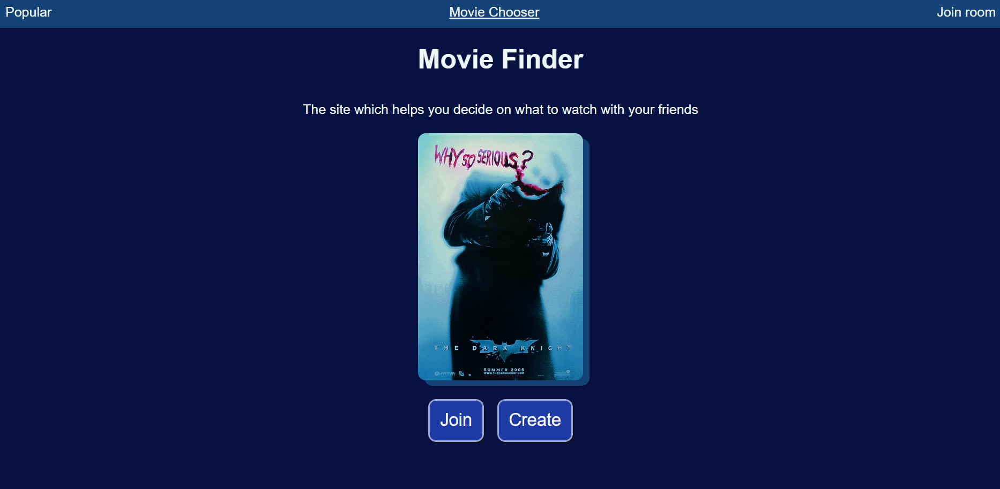
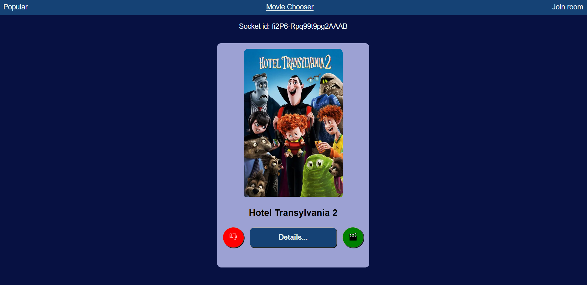
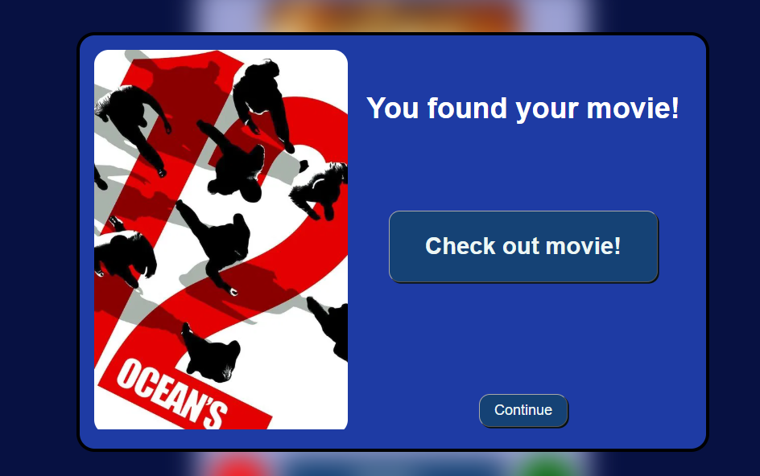
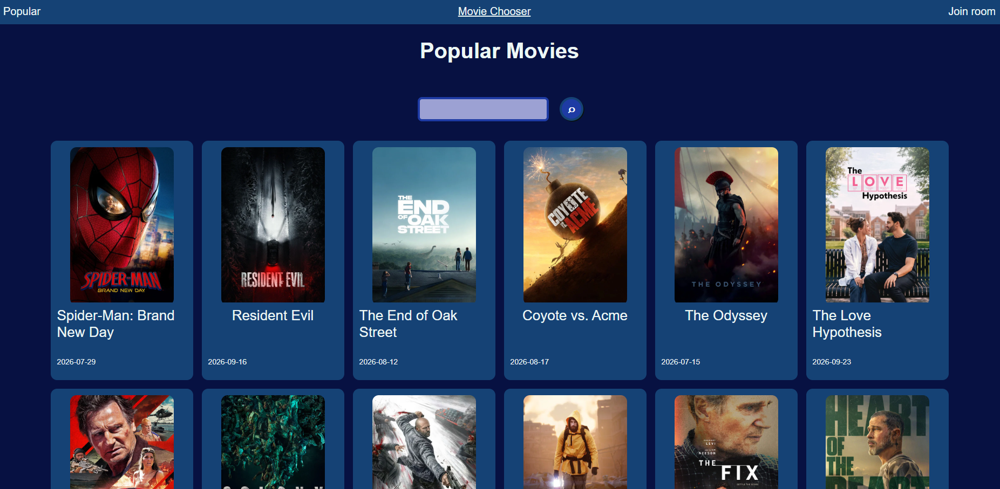

# Movie Finder App
A full-stack web application which helps you choose the next movie to watch by yourself or alongside your friends.
- this project uses React, Node.js, Socket.io, and TMDB API


- You can check out a demo of this page [here](https://moviefinderpage.vercel.app).

## Getting Started

### Prerequisites

This project requires Node.js.
- If you do not have Node.js installed, you can install it from [here](https://nodejs.org/en/download);

### Installation

1. Paste this line into your terminal:

```shell
git  clone  https://github.com/Pampu-Rares/movie-chooser.git
```

2. There are two main folders in this project: `backend` and `frontend`.

### Backend

The `backend` contains the Node.js server to which the `frontend` connects to receive data from the TMDB API and to socket.io. It requires a `.env` file in the root of for the TMDB API KEY and for the local port on which to run:

1. In the newly created `.env` file: 
```env
API_KEY= # enter your TMDB API key
PORT=3030 # if you host the project locally
```
- If you do not have an API key, you can create one from the TMDB official website

2. Install the server dependencies: 

```shell
npm install
```

3. To run the server locally: open a terminal in the `backend` directory, then run the following command:

```shell
npm run backend
```

### Frontend

The `frontend` contains the React app for the website. It also requires a `.env` file for the port of the server

1. Add the `.env` file in the root of the `frontend`, and enter the same port as in the `backend/.env` file with this name:

```env
VITE_SERVER_URL=http://localhost:3030 # needs to match the other .env file's PORT, if you're hosting it locally
```

2. Open a terminal in the `frontend` folder and write again:

```shell
npm install
```

3. Afterwards, to run the React app:

```shell
npm run dev
```

4. Open a tab in your browser to the localhost prompted in the terminal to use the project.

## Usage

Create or join a room with your friends and press play. The socket.io server then sends the room up to 10 movies to like or dislike based on your preferences. If more than half of the people in the room like a certain movie, it will appear as a match. At the end of all of the movies, the room admin can choose to play again if the movies were unsatisfactory.

### Movie Finder

- Create or join a room alongside your friends and start voting
- The room can be as big as you'd like
- At the end of the 10 shown movies, the room admin can choose to play again if the movies were unsatisfactory.



- If more than half of the people in a room like a movie, it will appear on screen as a match:
- You can then choose to keep looking and skip the current match, or check out the movie



- All matches will appear at the end of the round on screen as a list
- As of yet, the check out movie button doesn't do anything. This will be corrected in a future commit

### See popular movies

- Check out the most popular movies or search for a specific movie



## License

This project is licensed under the **Source-Available Non-Commercial License**.
See the [LICENSE](LICENSE) file for the full license terms.

## Contact
For improvements or suggestions you can contact me here:
Pampu Rares - [rarespampu@gmail.com](mailto:rarespampu@gmail.com)